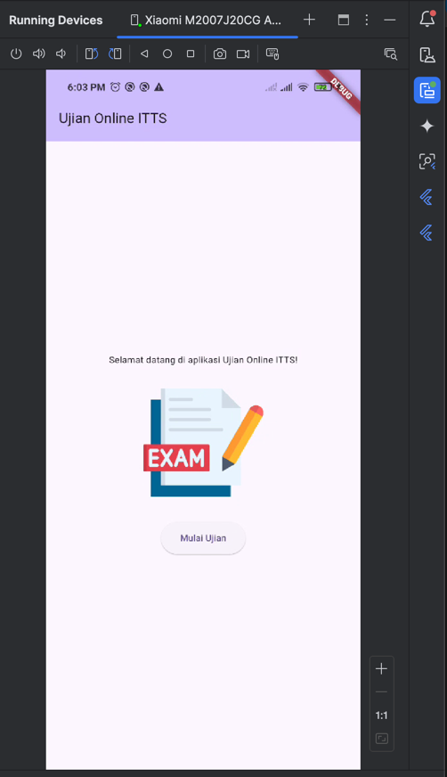

# uts_dwi_aji_pangestu

A new Flutter project.

## Getting Started

This project is a starting point for a Flutter application.

A few resources to get you started if this is your first Flutter project:

- [Lab: Write your first Flutter app](https://docs.flutter.dev/get-started/codelab)
- [Cookbook: Useful Flutter samples](https://docs.flutter.dev/cookbook)

For help getting started with Flutter development, view the
[online documentation](https://docs.flutter.dev/), which offers tutorials,
samples, guidance on mobile development, and a full API reference.

## Gambar Hasil Running Aplikasi

Berikut adalah beberapa tampilan dari aplikasi yang sudah berjalan:

### Tampilan Home

### Tampilan Form Ujian

### Tampilan Form Ujian Ketika di tampilkan ringkasan tapi belum diisi

### Tampilan Form Ujian Ketika klik dropwown

### Tampilan Form Ujian Ketika data diisi

### Tampilan Ringkasan Data

